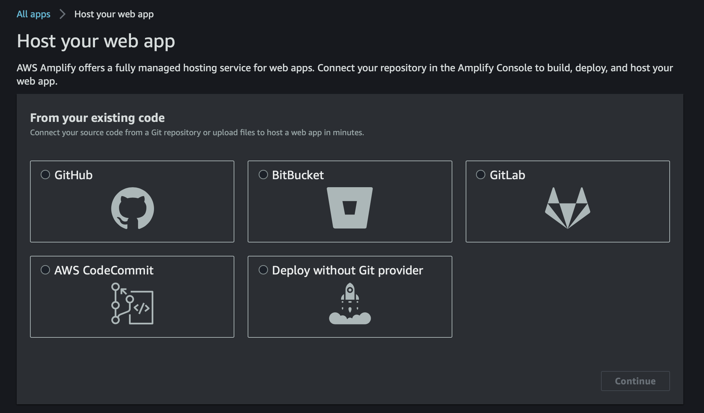
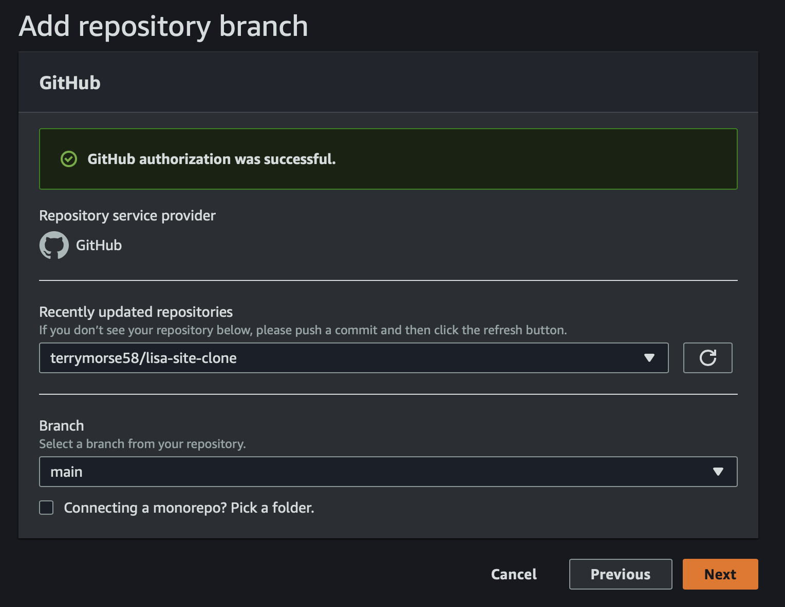
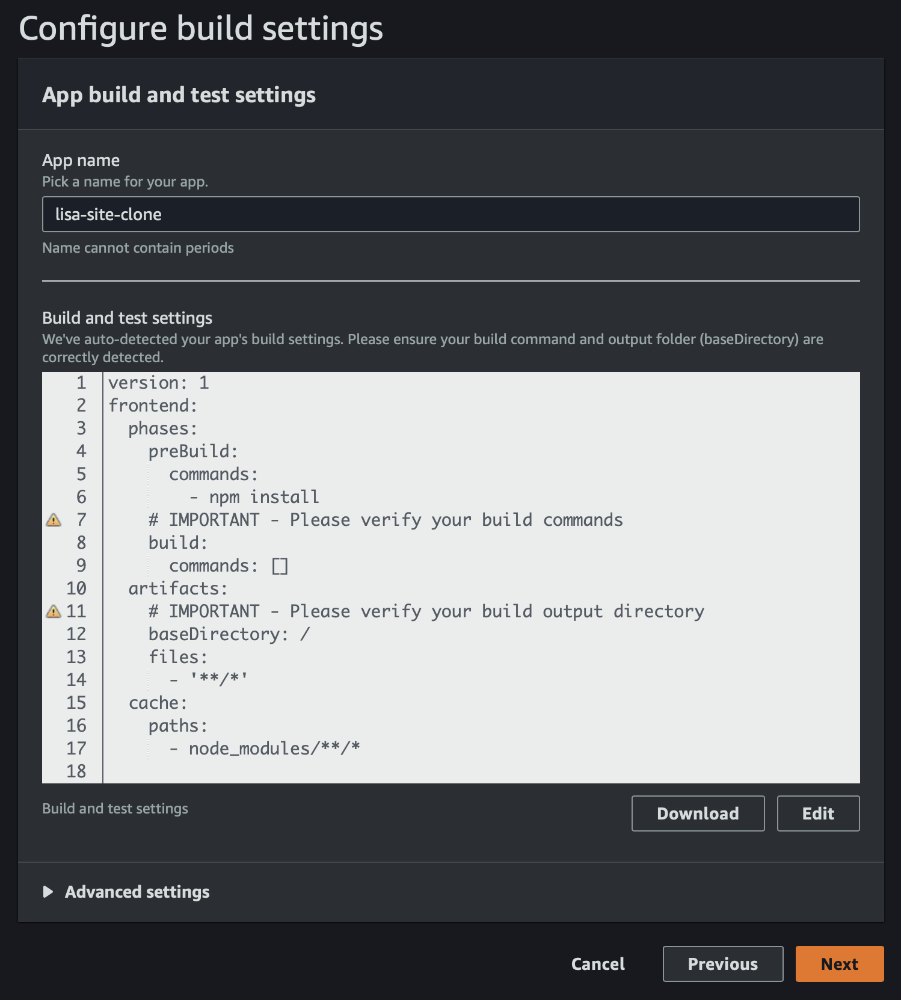
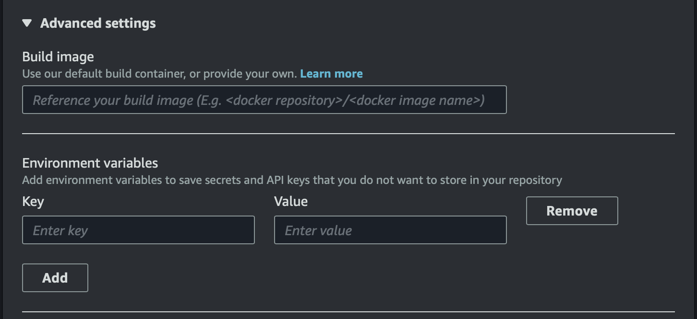
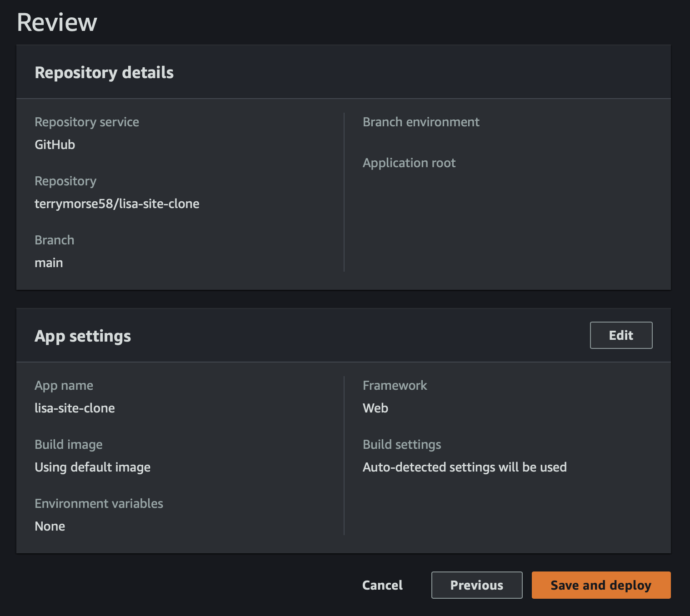
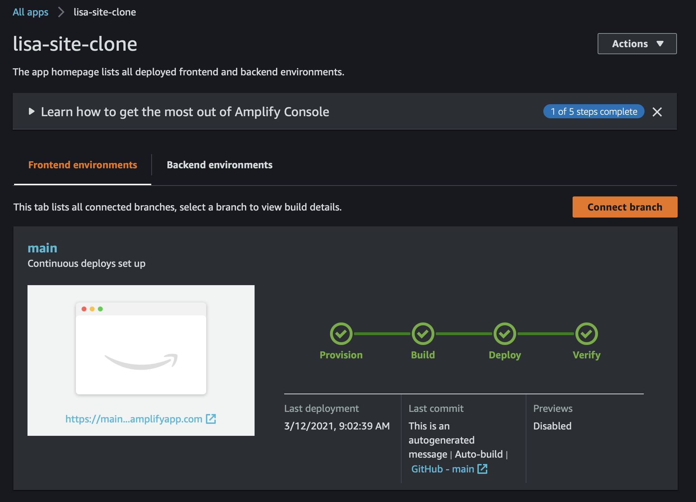
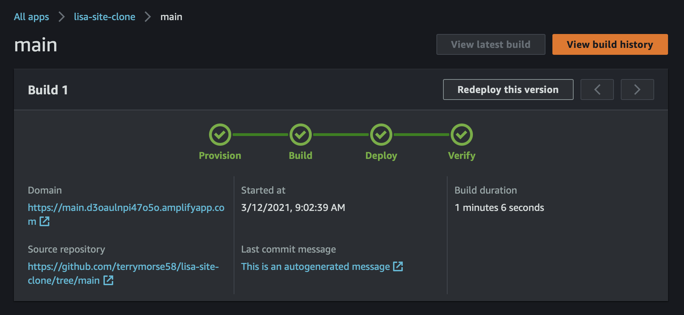

# Continuous Deployment from Git to AWS Amplify
How to use AWS Amplify to perform automatic site updates whenever a Git repo is updated
---
---
## Step 1 - Create a repo on GitHub

[GitHub Docs > Create a repo](https://docs.github.com/en/github/getting-started-with-github/create-a-repo)

## Step 2 - Connect repo to AWS

To connect the GitHub repo, log in to the AWS Amplify Console and choose **Get Started** under **Deploy**.

Select **GitHub** and click **Continue**.

Select the GitHub repo and branch, then click **Next**.

Review build settings, making any needed edits to complete a build.

**Note:** Environment variables may be added under *Advanced settings*.

Review the Repository details and App settings, then click **Save and deploy**.

A Build Status page will appear.

Clicking on the Git branch name (*main* in example above) shows the details of the deployed site.

---
## Other Resources

### [Tutorial - Host a Static Website using AWS Amplify](https://aws.amazon.com/getting-started/hands-on/host-static-website/)
#### What You Will Learn
 * **Host a static website** usng [AWS Amplify](https://aws.amazon.com/amplify/console/) in the AWS console. AWS Amplify provides fully managed hosting for static websites and web apps. Amplify’s hosting solution leverages Amazon CloudFront and Amazon S3 to deliver your site assets via the AWS content delivery network (CDN).
 * **Set up continuous deployment:** Amplify offers a Git-based workflow with continuous deployment, allowing you to automatically deploy updates to your site on every code commit.
